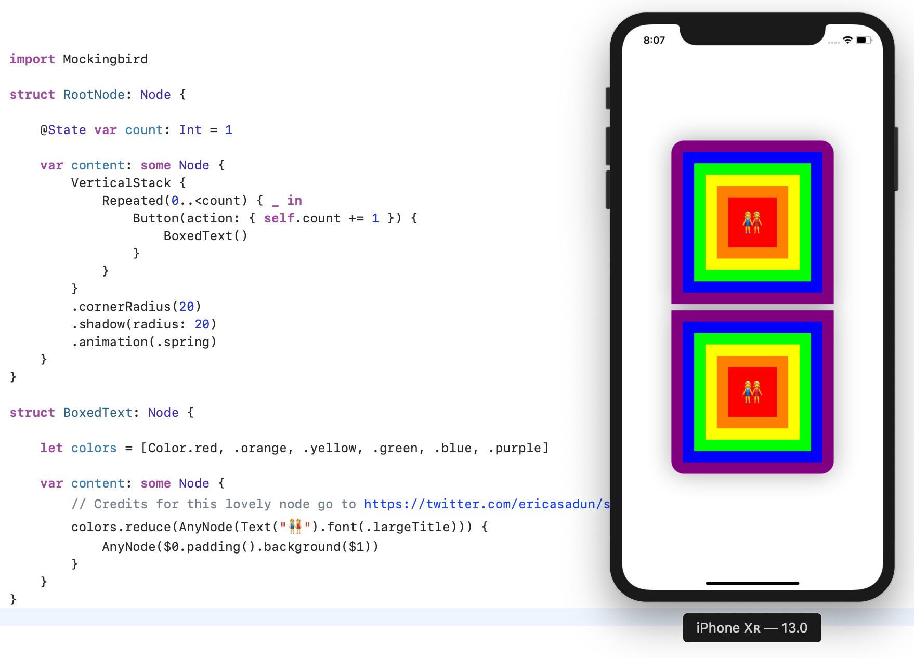

#  Mockingbird

Mockingbird is an experiment of implementing a UI layout and rendering framework inspired by SwiftUI. 

The implementation consists of two parts:

 - *Core* - defines nodes, modifiers and properties
- *UIKit Rendering* - parsing the Node hierarchy and rendering it with UIKit

The framework renders the Node hierarchy by mirroring it in UIKit. During the rendering process it sets up observations of dynamic properties and updates the mirrored UIKit hierarchy accordingly. Only the updated subtree is affected. The framework tries its best to preserve the subtree UIKit hierarchy and is generally very successful at doing that.

Dynamic view properties like `@State` and `@BindableObject` are built on top of ReactiveKit's subjects and are observed by leveraging reflection through `Mirror` type.



## What to expect

Nothing. This is an experiment and it could have a major design flaw that would render it useless in practice. Do not use this in production or expect that it will ever be usable.

## Contributing

If you think that we might have something going on here, do join the project! Start by opening an issue either with an opinion or a suggestion. If you would like to implement something, write a brief description of what would you like to do and how would you do it. We can discuss the approach and assign you the task.

## Current State

Following node and modifiers are available in their basic form

- `Text`
- `Button`
- `VerticalStack`
- `HorizontalStack`
- `Repeated`
- `Padded`
- `Hugged`
- `Framed`
- `Colored`
- `Clipped`
- `ShadowCaster` 
- `Animation`
- ...
- `Context`
- `@State`
- `@BindableObject`
- `UINodeRenderingController`

## Installation

The framework currently targets iOS 9. However, Swift opaque types are not available below iOS 13 at the moment so `some Node` expressions have to be replaced with `AnyNode`.

### Carthage

```
github "DeclarativeHub/Mockingbird"
```
